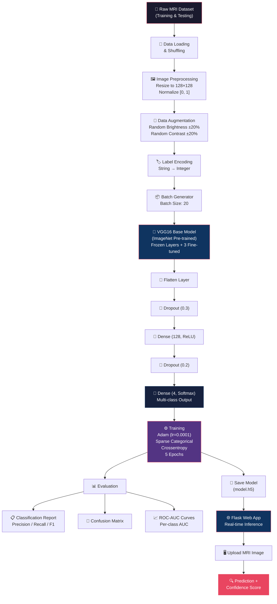

<p align="center">
  
  
  
  
  
</p>

---

# 🧠 Brain Tumor Detection Using Deep Learning

> **An end-to-end medical computer vision system for classifying brain tumors from MRI scans using Transfer Learning (VGG16) and a Flask-based web interface for real-time clinical inference.**

---

## 📋 Table of Contents

- [Project Overview](#-project-overview)
- [Key Features](#-key-features)
- [Tech Stack](#-tech-stack)
- [Model Architecture & Workflow](#-model-architecture--workflow)
- [Dataset Information](#-dataset-information)
- [Project Structure](#-project-structure)
- [Environment & Installation Setup](#-environment--installation-setup)
- [Usage Instructions](#-usage-instructions)
- [Evaluation & Results](#-evaluation--results)
- [Sample MRI Predictions](#-sample-mri-predictions)
- [Future Improvements](#-future-improvements)
- [License](#-license)
- [Acknowledgements](#-acknowledgements)

---

## 🔬 Project Overview

Brain tumors are among the most critical and life-threatening conditions in neurology. Early and accurate detection is essential for effective treatment planning. This project implements a **deep learning–based classification system** that analyzes **brain MRI scans** to detect and classify tumors into one of four categories:

| Class | Description |
|:---:|:---|
| 🔴 **Glioma** | A tumor that originates in the glial cells of the brain or spine |
| 🟠 **Meningioma** | A tumor that arises from the meninges, the membranes surrounding the brain and spinal cord |
| 🟣 **Pituitary** | A tumor that forms in the pituitary gland at the base of the brain |
| 🟢 **No Tumor** | Healthy brain MRI with no detectable tumor |

### Objective

The system leverages **Transfer Learning** with a pre-trained **VGG16** convolutional neural network (fine-tuned on brain MRI data) to perform multi-class classification. A **Flask web application** provides a user-friendly interface for clinicians and researchers to upload MRI images and receive instant predictions with confidence scores.

---

## ✨ Key Features

- 🏥 **Medical-grade classification** — Classifies brain MRI scans into 4 categories (Glioma, Meningioma, Pituitary, No Tumor)
- 🧬 **Transfer Learning with VGG16** — Pre-trained ImageNet weights with fine-tuned top layers for domain adaptation
- 🎨 **Real-time data augmentation** — Brightness and contrast augmentation applied on-the-fly during training
- 🌐 **Web-based inference** — Flask application for drag-and-drop MRI upload and instant prediction
- 📊 **Comprehensive evaluation** — Classification reports, confusion matrices, and multi-class ROC-AUC curves
- ☁️ **Google Colab compatible** — Training notebook designed for GPU-accelerated training on Colab

---

## 🛠 Tech Stack

| Category | Technology | Purpose |
|:---|:---|:---|
| **Deep Learning Framework** | TensorFlow / Keras | Model building, training, and inference |
| **Pre-trained Model** | VGG16 (ImageNet) | Transfer learning base architecture |
| **Image Processing** | Pillow (PIL) | Image loading, augmentation (brightness/contrast) |
| **Numerical Computing** | NumPy | Array operations and data manipulation |
| **Data Utilities** | scikit-learn | Label encoding, shuffling, metrics, ROC-AUC |
| **Data Visualization** | Matplotlib, Seaborn | Training curves, confusion matrix, ROC plots |
| **Web Framework** | Flask | Deployment web server for inference UI |
| **Frontend** | HTML5, Bootstrap 5 | Responsive web interface for MRI upload |
| **Development Environment** | Google Colab | GPU-accelerated model training |
| **Version Control** | Git / GitHub | Source code management and collaboration |

---

## 🏗 Model Architecture & Workflow

### End-to-End Machine Learning Pipeline



### Model Summary

| Component | Detail |
|:---|:---|
| **Base Model** | VGG16 (pre-trained on ImageNet) |
| **Input Shape** | `(128, 128, 3)` — RGB MRI images |
| **Fine-tuned Layers** | Last 3 convolutional layers of VGG16 |
| **Classifier Head** | Flatten → Dropout(0.3) → Dense(128, ReLU) → Dropout(0.2) → Dense(4, Softmax) |
| **Optimizer** | Adam (`learning_rate = 0.0001`) |
| **Loss Function** | Sparse Categorical Crossentropy |
| **Metric** | Sparse Categorical Accuracy |
| **Batch Size** | 20 |
| **Epochs** | 5 |

---

## 📂 Dataset Information

### Source

This project uses the **Brain Tumor MRI Dataset**, a widely-used benchmark for brain tumor classification. The dataset is available on Kaggle:

> 🔗 [Brain Tumor MRI Dataset – Kaggle](https://www.kaggle.com/datasets/masoudnickparvar/brain-tumor-mri-dataset)

### Dataset Structure

The dataset follows a standard image classification directory structure with four classes:

```
MRI Images/
├── Training/
│   ├── glioma/          # Glioma tumor MRI scans
│   ├── meningioma/      # Meningioma tumor MRI scans
│   ├── notumor/         # Healthy brain MRI scans (no tumor)
│   └── pituitary/       # Pituitary tumor MRI scans
│
└── Testing/
    ├── glioma/
    ├── meningioma/
    ├── notumor/
    └── pituitary/
```

### Preprocessing Pipeline

| Step | Description |
|:---|:---|
| **Resize** | All images resized to `128 × 128` pixels |
| **Normalization** | Pixel values scaled to `[0, 1]` range (`/ 255.0`) |
| **Brightness Augmentation** | Randomly adjusted by a factor within `[0.8, 1.2]` |
| **Contrast Augmentation** | Randomly adjusted by a factor within `[0.8, 1.2]` |
| **Label Encoding** | Class folder names mapped to integer indices |
| **Shuffling** | Training and test sets randomly shuffled using `sklearn.utils.shuffle` |

---

## 📁 Project Structure

```
Cancer-Detection-Using-Deep-Learning/
│
├── main.py                              # Flask web application (inference server)
├── requirments.txt                      # Python dependencies
├── LICENSE                              # MIT License
├── README.md                            # Project documentation (this file)
├── .gitignore                           # Git ignore rules
│
├── models/
│   ├── Brain_Tumour_Detection.ipynb     # Jupyter Notebook (training pipeline)
│   └── model.h5                         # Trained model weights (~128 MB)
│
├── templates/
│   └── index.html                       # Flask web UI (Bootstrap 5)
│
├── uploads/                             # Uploaded MRI images (runtime)
│
└── sample MRI images/                   # Example MRI scans for testing
    ├── Te-gl_0015.jpg                   # Glioma sample
    ├── Te-meTr_0001.jpg                 # Meningioma sample
    ├── Te-noTr_0004.jpg                 # No tumor sample
    └── Te-piTr_0003.jpg                 # Pituitary sample
```

---

## ⚙️ Environment & Installation Setup

### Prerequisites

- **Python** 3.8 or higher
- **pip** package manager
- **Git** for cloning the repository
- **(Optional)** NVIDIA GPU with CUDA for accelerated training

### 1. Clone the Repository

```bash
git clone https://github.com/Kivindu02/Cancer-Detection-Using-Deep-Learning.git
cd Cancer-Detection-Using-Deep-Learning
```

### 2. Create a Virtual Environment

```bash
# Create virtual environment
python -m venv venv

# Activate (Windows)
venv\Scripts\activate

# Activate (macOS / Linux)
source venv/bin/activate
```

### 3. Install Dependencies

```bash
pip install tensorflow numpy pillow scikit-learn matplotlib seaborn flask
```

Or install from the requirements file:

```bash
pip install -r requirments.txt
```

> **📌 Note:** The `requirments.txt` file is currently empty. The core dependencies are listed below for manual installation.

### Core Dependencies

| Package | Version (Recommended) | Purpose |
|:---|:---|:---|
| `tensorflow` | ≥ 2.10 | Deep learning framework |
| `numpy` | ≥ 1.21 | Numerical operations |
| `Pillow` | ≥ 9.0 | Image processing |
| `scikit-learn` | ≥ 1.0 | Metrics and utilities |
| `matplotlib` | ≥ 3.5 | Visualization |
| `seaborn` | ≥ 0.12 | Statistical plots |
| `flask` | ≥ 2.2 | Web server |

### 4. GPU Acceleration Setup (Optional)

For GPU-accelerated training, ensure CUDA and cuDNN are properly installed:

```bash
# Verify GPU availability
python -c "import tensorflow as tf; print('GPUs:', tf.config.list_physical_devices('GPU'))"
```

> **💡 Tip:** The training notebook is designed to run on **Google Colab**, which provides free GPU access. Open the notebook directly in Colab using the badge link at the top of the notebook.

### 5. Download the Dataset

1. Download the [Brain Tumor MRI Dataset](https://www.kaggle.com/datasets/masoudnickparvar/brain-tumor-mri-dataset) from Kaggle
2. Extract and organize the data into `Training/` and `Testing/` directories as shown in the [Dataset Structure](#dataset-structure) section
3. For Google Colab training, upload the dataset to your Google Drive at:
   ```
   /content/drive/MyDrive/MRI Images/
   ```

---

## 🚀 Usage Instructions

### Option A: Model Training (Jupyter Notebook / Google Colab)

The complete training pipeline is in [`models/Brain_Tumour_Detection.ipynb`](models/Brain_Tumour_Detection.ipynb).

**Using Google Colab (Recommended):**

1. Open the notebook in Colab:
   
   [](https://colab.research.google.com/github/Kivindu02/Cancer-Detection-Using-Deep-Learning/blob/main/Brain_Tumour_Detection.ipynb)

2. Mount your Google Drive (contains the dataset)
3. Run all cells sequentially to:
   - Load and preprocess the MRI dataset
   - Build and compile the VGG16 transfer learning model
   - Train the model for 5 epochs
   - Evaluate with classification report, confusion matrix, and ROC curves
   - Save the trained model as `model.h5`

4. Download the trained `model.h5` file and place it in the `models/` directory

**Training pipeline steps:**

```
Cell 1  → Mount Google Drive
Cell 2  → Import libraries (TensorFlow, Keras, PIL, sklearn)
Cell 3  → Load dataset paths and labels, shuffle
Cell 4  → Visualize sample MRI images (2×5 grid)
Cell 5  → Define augmentation & preprocessing helpers
Cell 6  → Build VGG16 model, compile, and train (5 epochs)
Cell 7  → Plot training accuracy and loss curves
Cell 8  → Classification report (Precision, Recall, F1-Score)
Cell 9  → Confusion matrix heatmap
Cell 10 → Multi-class ROC curves with per-class AUC
Cell 11 → Save trained model to model.h5
```

### Option B: Web Application — Real-time Inference

The Flask web application lets you upload an MRI image and get an instant prediction.

**1. Ensure the trained model is in place:**

```bash
# The model file should exist at:
models/model.h5
```

**2. Start the Flask server:**

```bash
python main.py
```

**3. Open the web interface:**

Navigate to [`http://127.0.0.1:5000`](http://127.0.0.1:5000) in your browser.

**4. Upload an MRI image:**

- Click **"Select MRI Image"** and choose a brain MRI scan (`.jpg`, `.png`, etc.)
- Click **"Upload and Detect"**
- The system will display:
  - ✅ The predicted class (e.g., `Tumor: glioma` or `No Tumor`)
  - 📊 The confidence score (e.g., `98.73%`)
  - 🖼️ The uploaded MRI image

**5. Test with sample images:**

Use the provided sample MRI images in the `sample MRI images/` directory for quick testing:

```bash
sample MRI images/
├── Te-gl_0015.jpg       # → Expected: Glioma
├── Te-meTr_0001.jpg     # → Expected: Meningioma
├── Te-noTr_0004.jpg     # → Expected: No Tumor
└── Te-piTr_0003.jpg     # → Expected: Pituitary
```

### Option C: Programmatic Inference (Python Script)

```python
from tensorflow.keras.models import load_model
from tensorflow.keras.utils import load_img, img_to_array
import numpy as np

# Load the trained model
model = load_model('models/model.h5')

# Class labels
class_labels = ['pituitary', 'glioma', 'notumor', 'meningioma']

# Load and preprocess a new MRI image
IMAGE_SIZE = 128
img = load_img('path/to/mri_image.jpg', target_size=(IMAGE_SIZE, IMAGE_SIZE))
img_array = img_to_array(img) / 255.0
img_array = np.expand_dims(img_array, axis=0)

# Make prediction
predictions = model.predict(img_array)
predicted_class = class_labels[np.argmax(predictions)]
confidence = np.max(predictions) * 100

print(f"Prediction: {predicted_class}")
print(f"Confidence: {confidence:.2f}%")
```

---

## 📊 Evaluation & Results

The model is evaluated on the held-out test set using the following metrics:

| Metric | Description |
|:---|:---|
| **Precision** | Proportion of true positives among predicted positives |
| **Recall** | Proportion of actual positives correctly identified |
| **F1-Score** | Harmonic mean of Precision and Recall |
| **Confusion Matrix** | Visualizes true vs. predicted labels across all 4 classes |
| **ROC-AUC Curve** | Per-class Receiver Operating Characteristic with Area Under Curve |

The complete evaluation (classification report, confusion matrix heatmap, and multi-class ROC curves) is generated in the training notebook.

---

## 🖼 Sample MRI Predictions

The `sample MRI images/` directory includes test MRI scans for each class:

| Sample File | Expected Class | Description |
|:---|:---|:---|
| `Te-gl_0015.jpg` | Glioma | Glioma tumor MRI scan |
| `Te-meTr_0001.jpg` | Meningioma | Meningioma tumor MRI scan |
| `Te-noTr_0004.jpg` | No Tumor | Healthy brain MRI scan |
| `Te-piTr_0003.jpg` | Pituitary | Pituitary tumor MRI scan |

---

## 🔮 Future Improvements

- [ ] **Expand to more tumor types** — Include additional categories such as schwannoma, craniopharyngioma
- [ ] **Use larger input resolution** — Increase image size from 128×128 to 224×224 for richer features
- [ ] **Experiment with other architectures** — Try ResNet50, EfficientNet, or DenseNet for better accuracy
- [ ] **Add Grad-CAM visualizations** — Highlight regions of the MRI that influence the model's decision
- [ ] **Dockerize the application** — Create a Docker container for portable deployment
- [ ] **Deploy to cloud** — Host on AWS/GCP/Azure for production-scale inference
- [ ] **Add patient report generation** — Generate PDF reports with diagnosis and confidence
- [ ] **Implement DICOM support** — Accept standard medical imaging formats directly

---

## 📜 License

This project is licensed under the **MIT License** — see the [LICENSE](LICENSE) file for details.

```
MIT License — Copyright (c) 2026 Kivindu Rajamanukula
```

---

## 🙏 Acknowledgements

- **[Brain Tumor MRI Dataset](https://www.kaggle.com/datasets/masoudnickparvar/brain-tumor-mri-dataset)** — Masoud Nickparvar (Kaggle)
- **[VGG16](https://arxiv.org/abs/1409.1556)** — Karen Simonyan & Andrew Zisserman, *"Very Deep Convolutional Networks for Large-Scale Image Recognition"*
- **[TensorFlow](https://www.tensorflow.org/)** — Google Brain Team
- **[Flask](https://flask.palletsprojects.com/)** — Pallets Projects

---

<p align="center">
  <b>⭐ If you found this project useful, please give it a star on <a href="https://github.com/Kivindu02/Cancer-Detection-Using-Deep-Learning">GitHub</a>!</b>
</p>

<p align="center">
  Made with ❤️ by <a href="https://github.com/Kivindu02">Kivindu Rajamanukula</a>
</p>
